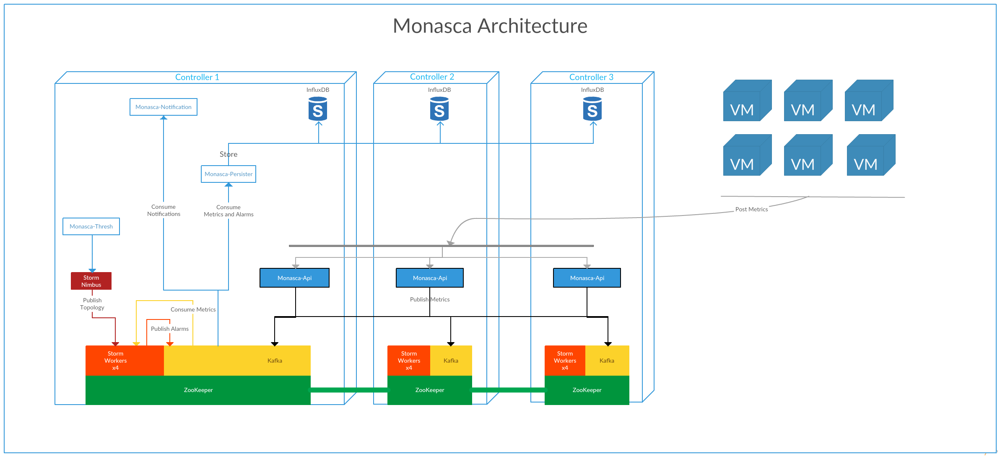

* [Introduction](README.md)
* [Installation](install.md)
* [Setup](setup.md)

# Introduction

## Monasca

[Monasca](http://monasca.io/) is a open-source multi-tenant, highly scalable, performant, fault-tolerant monitoring-as-a-service solution that integrates with OpenStack. It uses a REST API for high-speed metrics processing and querying and has a streaming alarm engine and notification engine. 

## Architecture overview

1. [Monitoring API (monasca-api)](https://github.com/openstack/monasca-api) : A RESTful API

2. [Monitoring Client (python-monascaclient)](https://github.com/openstack/python-monascaclient/) : A Python command line client and library that communicates and controls the Monitoring API.

3. [Monitoring Agent (monasca-agent)](https://github.com/openstack/monasca-agent) : A modern Python monitoring agent for gathering metrics and sending them to the Monasca API.

4. [Persister (monasca-persister)](https://github.com/openstack/monasca-persister) : Consumes metrics and alarm state transitions from Kafka and stores them in InfluxDB

5. [Threshold Engine (monasca-thresh)](https://github.com/openstack/monasca-thresh) : Computes thresholds on metrics and publishes alarms to Kafka when exceeded. The current state is also saved in the MySQL database. Based on Apache Storm.

6. [Notification Engine (monasca-notification)](https://github.com/openstack/monasca-notification) : This engine reads alarms from Kafka and then notifies the customer using their configured notification method.

7. [Monitoring UI (monasca-ui)](https://github.com/openstack/monasca-ui) : A Horizon dashboard for visualizing the overall health and status of an OpenStack cloud.

8. [Message Queue ( Kafka )](http://kafka.apache.org/) : A third-party component that primarily receives published metrics from the Monitoring API and alarm state transition messages from the Threshold Engine that are consumed by other components, such as the Persister and Notification Engine.

9. [Metrics and Alarms Database ( InfluxDB )](https://influxdata.com/) : : A third-party component that primarily stores metrics and the alarm state history

## Environment

In this tutorial we will install **Monasca** on OpenStack Liberty release on three nodes (controller nodes) based on CentOS 7.

